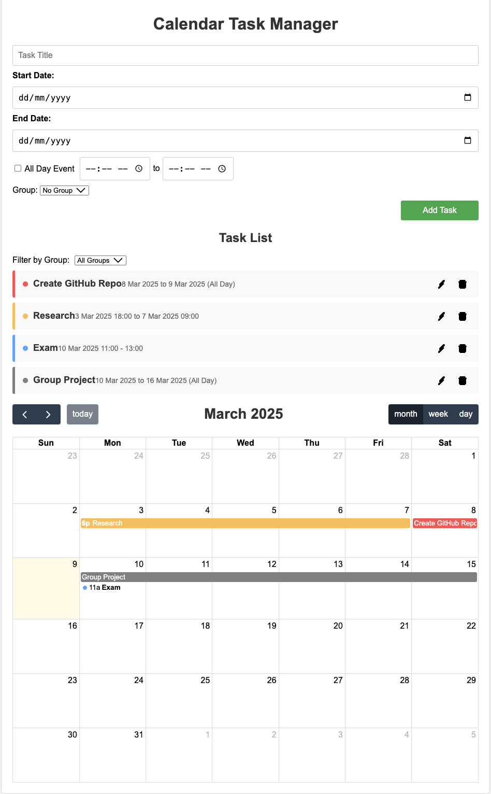

# Calendar Task Manager


## Table of Contents 

- [Introduction](#introduction)
- [Features](#features)
- [Live Demo](#live-demo)
- [Technologies Used](#technologies-used)
- [Installation](#installation)
- [License](#license)


---

## Introduction

**My Calendar** is a user-friendly web application designed to help individuals efficiently manage their tasks and schedules. By integrating a clear task list with an interactive calendar view, the application ensures that users can keep track of their daily to-dos and upcoming deadlines seamlessly. Leveraging modern web technologies, **Calendar Task Manager** offers a responsive and intuitive user experience, accessible across various devices.

## Features

- **Task Management**: Easily add, view, and delete tasks.
- **Deadline Setting**: Assign specific dates and times to tasks or mark them as all-day events.
- **Calendar Integration**: Visualize tasks on an interactive calendar using the FullCalendar library.
- **Persistent Storage**: Utilize the browser's LocalStorage to ensure tasks are saved across sessions.
- **Responsive Design**: Optimized for desktops, tablets, and mobile devices.
- **Easy Navigation**: Switch effortlessly between different calendar views (month, week, day).

## Live Demo

Experience the application firsthand by visiting the live demo:

🔗 [Calendar Task Manager Live Demo](https://vincentcomp.github.io/Calendar/)

## Technologies Used

- **Frontend**:
  - HTML5
  - CSS3
  - JavaScript (ES6)
  - [FullCalendar](https://fullcalendar.io/) library for calendar functionalities

- **Storage**:
  - Browser's LocalStorage for data persistence

- **Deployment**:
  - [GitHub Pages](https://pages.github.com/) for hosting the live application

## Installation

To run **Calendar Task Manager** locally on your machine, follow these steps:

1. **Clone the Repository**

   ```bash
   git clone https://github.com/vincentcomp/Calendar.git

2. **Clone the Repository**
    ```bash
    cd Calendar


3. **Open index.html in Your Browser**

    You can simply double-click the index.html file, or
    Right-click on index.html and choose Open with followed by your preferred browser.
    Note: For full functionality, especially when dealing with LocalStorage, it's recommended to use a local web server.

## License
This project is licensed under the MIT License. See the [LICENSE file](LICENSE) for details.

